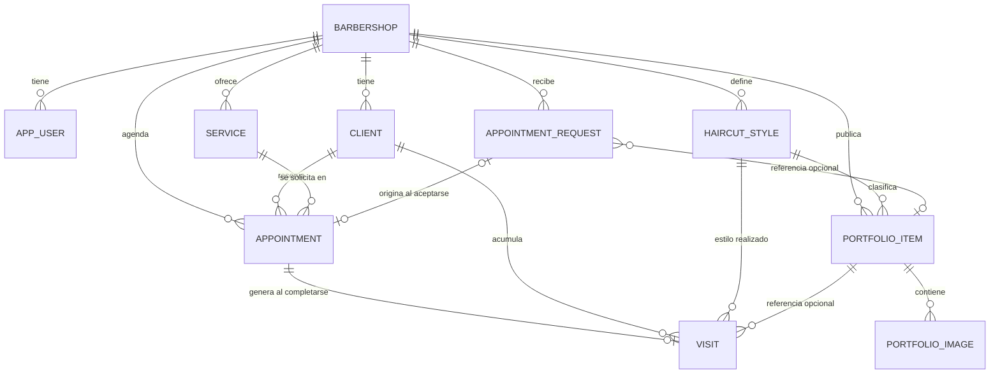

# Diagrama entidad-relación

Nota: respecto a la Etapa 1, el vínculo solicitud ↔ turno vive solo en
`appointment_request.appointment_id` (se evita una referencia circular entre tablas).

```mermaid
erDiagram
    BARBERSHOP ||--o{ APP_USER : tiene
    BARBERSHOP ||--o{ CLIENT : tiene
    BARBERSHOP ||--o{ SERVICE : ofrece
    BARBERSHOP ||--o{ HAIRCUT_STYLE : define
    BARBERSHOP ||--o{ PORTFOLIO_ITEM : publica
    BARBERSHOP ||--o{ APPOINTMENT : agenda
    BARBERSHOP ||--o{ APPOINTMENT_REQUEST : recibe
    CLIENT ||--o{ APPOINTMENT : reserva
    SERVICE ||--o{ APPOINTMENT : "se solicita en"
    APPOINTMENT ||--o| VISIT : "genera al completarse"
    CLIENT ||--o{ VISIT : acumula
    HAIRCUT_STYLE ||--o{ PORTFOLIO_ITEM : clasifica
    HAIRCUT_STYLE ||--o{ VISIT : "estilo realizado"
    PORTFOLIO_ITEM ||--o{ PORTFOLIO_IMAGE : contiene
    PORTFOLIO_ITEM ||--o{ VISIT : "referencia opcional"
    APPOINTMENT_REQUEST |o--o| APPOINTMENT : "origina al aceptarse"
    APPOINTMENT_REQUEST }o--o| PORTFOLIO_ITEM : "referencia opcional"
```
